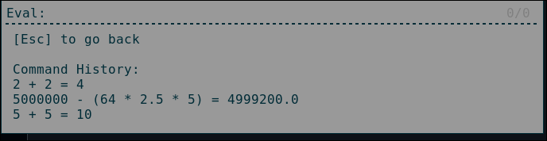

# rofi-calculator
Simple calculator built in Python using Rofi.

This project is licensed under MIT.

# Credits
 - To [bcbnz](https://github.com/bcbnz) for providing the rofi extension. (https://github.com/bcbnz/python-rofi)